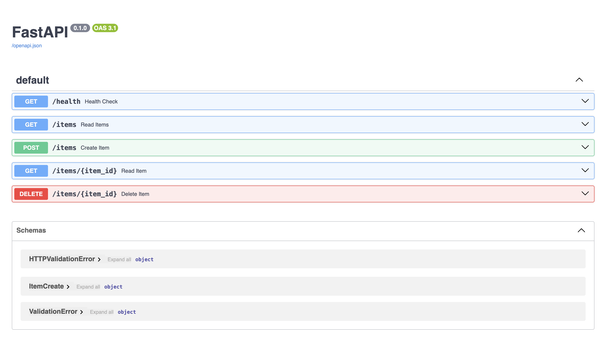
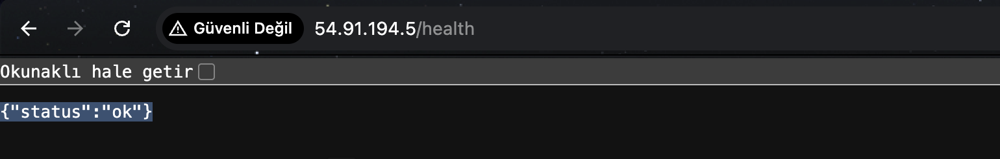
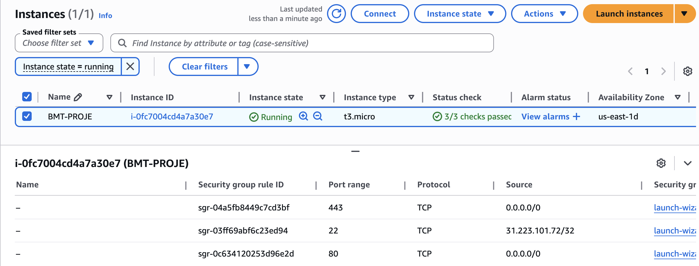
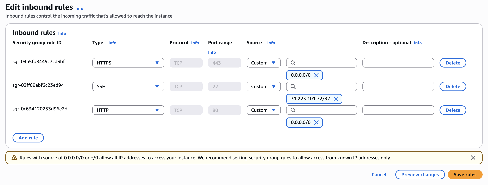
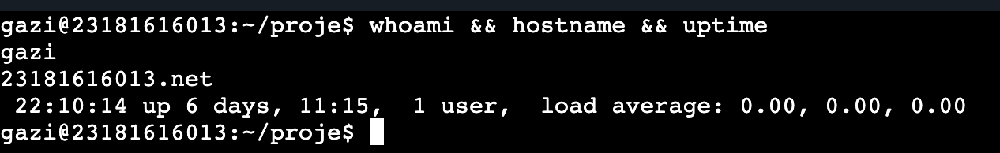

# BMT-408 Proje Evidence Dosyası

**Ad Soyad:** Veli Deniz Ayhan  
**Öğrenci No:** 23181616013  
**E-posta:** vdeniz.ayhan@gazi.edu.tr  

---

## 1. Docker Compose PS Çıktısı

5 konteyner başarıyla çalışmaktadır:

| CONTAINER ID | IMAGE | SERVICE | STATUS | PORTS |
|---|---|---|---|---|
| c1fce2decc6c | adminer | adminer | Up | 127.0.0.1:8080->8080/tcp |
| 1e8facc05418 | postgres:15-alpine | backup | Up | 5432/tcp |
| 6621c7100563 | nginx:alpine | nginx | Up 6 days | 0.0.0.0:80->80/tcp |
| 1cf10091c74c | proje-api | api | Up 6 days | — |
| 86da82b0a96b | postgres:15-alpine | db | Up 6 days | 5432/tcp (sadece internal) |

- **nginx** → Dış dünyaya tek çıkış noktası (port 80)
- **api** → FastAPI uygulaması, nginx arkasında (dışarıya port açık değil)
- **db** → PostgreSQL veritabanı (dışarıya port açık değil)
- **adminer** → DB yönetim arayüzü (sadece localhost:8080, dışarıya kapalı)
- **backup** → Günlük yedek servisi

---

## 2. Açık Portlar (ss -tulpn)

```
Netid   State    Local Address:Port   Process
tcp     LISTEN   0.0.0.0:22           sshd
tcp     LISTEN   0.0.0.0:80           docker-proxy (nginx)
tcp     LISTEN   127.0.0.1:8080       docker-proxy (adminer - sadece localhost)
tcp     LISTEN   [::]:22              sshd
tcp     LISTEN   [::]:80              docker-proxy (nginx)
tcp     LISTEN   *:9090               cockpit (yönetim paneli)
```

**Güvenlik notu:**
- DB portları (5432, 3306) dışarıya **kapalıdır**
- Adminer (8080) yalnızca `127.0.0.1` üzerinden erişilebilir, dışarıya **kapalıdır**
- Dışarıya açık portlar: **22** (SSH), **80** (HTTP), **9090** (Cockpit)

---

## 3. Güvenlik Duvarı Kuralları (nft list ruleset)

### Ana Firewall Kuralları (inet filter)

```
table inet filter {
    chain input {
        type filter hook input priority filter; policy drop;
        iif "lo" accept
        ct state established,related accept
        tcp dport 22 accept
        tcp dport 80 accept
        tcp dport 443 accept
    }
    chain forward {
        type filter hook forward priority filter; policy accept;
    }
    chain output {
        type filter hook output priority filter; policy accept;
    }
}
```

**INPUT zinciri varsayılan politikası: DROP**  
Yalnızca aşağıdaki portlara izin verilmiştir:
- Port 22 → SSH
- Port 80 → HTTP
- Port 443 → HTTPS

### Docker Ağ Kuralları (ip raw - Container İzolasyonu)

```
table ip raw {
    chain PREROUTING {
        ip daddr 172.18.0.2 iifname != "br-fb39843c0bb5" drop
        ip daddr 172.18.0.4 iifname != "br-fb39843c0bb5" drop
        ip daddr 172.18.0.3 iifname != "br-fb39843c0bb5" drop
        ip daddr 172.18.0.5 iifname != "br-fb39843c0bb5" drop
        ip daddr 172.18.0.6 iifname != "br-fb39843c0bb5" drop
        ip daddr 127.0.0.1 iifname != "lo" tcp dport 8080 drop
    }
}
```

Container'lara bridge ağı dışından doğrudan erişim engellenmiştir.  
Adminer (8080) yalnızca loopback (lo) arayüzünden erişilebilir.

---

## 4. Zamanlanmış Görev (crontab -l)

```
0 4 * * * /home/gazi/proje/backup/backup.sh
```

Her gün saat **04:00 (Europe/Istanbul)** zamanında PostgreSQL veritabanının yedeği otomatik olarak alınmaktadır.

### backup.sh İçeriği

```bash
#!/bin/bash
BACKUP_DIR="/home/gazi/proje/backup"
TIMESTAMP=$(date +"%F")
BACKUP_FILE="$BACKUP_DIR/db_backup_$TIMESTAMP.sql.gz"
docker exec proje-db-1 pg_dump -U user projedb | gzip > $BACKUP_FILE
find $BACKUP_DIR -type f -name "*.sql.gz" -mtime +7 -exec rm {} \;
```

- Yedek formatı: `.sql.gz` (sıkıştırılmış SQL dump)
- Saklama süresi: **7 gün** (eski yedekler otomatik silinir)

---

## 5. Yedek Dosyaları

7 günlük yedek başarıyla oluşturulmuştur:

```
-rw-rw-r-- 1 gazi gazi  backup/db_backup_2026-04-20.sql.gz
-rw-rw-r-- 1 gazi gazi  backup/db_backup_2026-04-21.sql.gz
-rw-rw-r-- 1 gazi gazi  backup/db_backup_2026-04-22.sql.gz
-rw-rw-r-- 1 gazi gazi  backup/db_backup_2026-04-23.sql.gz
-rw-rw-r-- 1 gazi gazi  backup/db_backup_2026-04-24.sql.gz
-rw-rw-r-- 1 gazi gazi  backup/db_backup_2026-04-25.sql.gz
-rw-rw-r-- 1 gazi gazi  backup/db_backup_2026-04-26.sql.gz
```

---

## 6. Restore Testi

Önce mevcut tablo drop edilmiş, ardından yedekten geri yüklenmiştir.

### Kullanılan Komutlar

```bash
# Adım 1: Tabloyu sil
docker exec -i proje-db-1 psql -U user -d projedb -c "DROP TABLE IF EXISTS items CASCADE;"

# Adım 2: Yedekten geri yükle
gunzip -c /home/gazi/proje/backup/db_backup_2026-04-20.sql.gz | docker exec -i proje-db-1 psql -U user -d projedb
```

### Çıktı 

```
DROP TABLE
SET
SET
SET
SET
SET
 set_config
------------

(1 row)

SET
SET
SET
SET
SET
SET
CREATE TABLE
ALTER TABLE
CREATE SEQUENCE
ALTER TABLE
ALTER SEQUENCE
ALTER TABLE
COPY 0
 setval
--------
      1
(1 row)

ALTER TABLE
CREATE INDEX
CREATE INDEX
```

**Restore başarılı** — hiçbir ERROR mesajı alınmamıştır.

---
## 7. Ekran Görüntüleri (Screenshots)

### FastAPI /docs (Swagger UI)


### Health Endpoint (Tarayıcıdan Bağlantı)


### EC2 Instance Running Durumu


### AWS Security Group Inbound Kuralları


### SSH Terminal Bağlantısı

